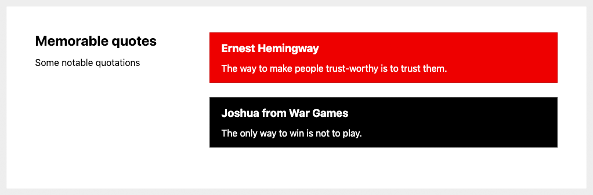
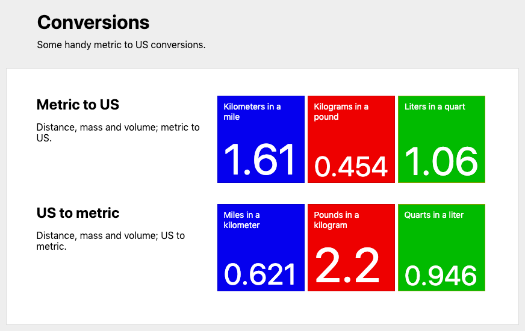
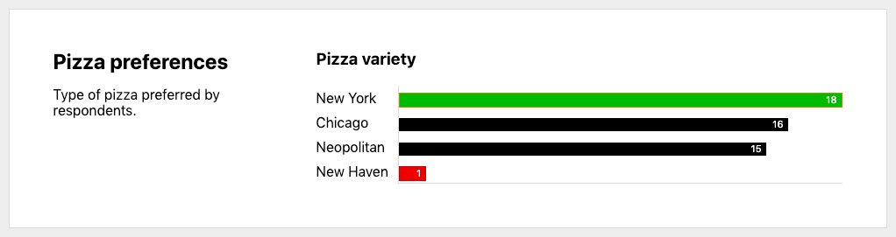
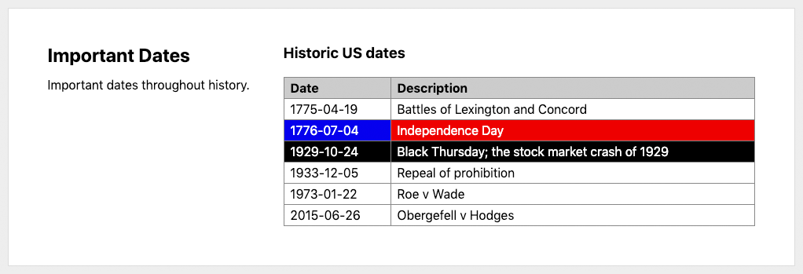



# Documentation

**[issue-dashboard](https://github.com/ethomson/issue-dashboard)** is a framework for creating dashboards from user data on GitHub, utilizing [GitHub Actions](https://github.com/features/actions) and [GitHub Pages](https://pages.github.com/).

You can define the data to collect out of GitHub -- using issue queries or arbitrary scripts -- and this tool will generate dashboards in HTML, that can be published to GitHub Pages, or Markdown, that can be published as a file in a repository or a comment in an issue.

Currently, this tool only supports instantaneous data -- for example: how many issues with a certain label are open _right now_, or how many pull requests are currently open that were created within the last week.  It does not support time series, meaning you cannot plot a graph of the number of open issues per day.

## Overview

A dashboard has one or more _sections_, which are logical divisions and serve as collections of _widgets_ that display data.  A widget is one of:

**String widget**

A string widget simply displays a string.  The data could be static, or the result of a JavaScript execution.  A string widget has a text _value_, and an optional _title_, _color_ and _url_.

**Number widget**

A number widget simply displays a numeric value.  Like string widgets, the data could be static or the result of a JavaScript expression.  But since only numbers are supported, instead of free-form strings, number widgets may be rendered smaller to save space in display.

In addition, the data source could be a GitHub [issue query](https://help.github.com/en/github/searching-for-information-on-github/searching-issues-and-pull-requests), in which case the number of results for the query will be displayed, and the widget will link to the query itself for more information.

A number widget has an _issue\_query_ or a numeric _value_, and an optional _title_, _color_ and _url_.

**Graph widget**

A graph widget displays a bar chart of multiple different numeric values.  Like a number widget, the data source for the values could be a static number, the result of executed JavaScript, or the number of matching results of a GitHub issue query.

A graph widget has _elements_, and an optional _title_.  Each element has an _issue\_query_ or a numeric _value_, and an optional _title_, _color_ and _url_.

**Table widget**

A table widget displays tabular data containing strings or numbers.  A table contains an optional header row and multiple element rows, each row containing cells.  Each cell may be a static string or the result of a Javascript expression.

In addition, the data source could be a GitHub [issue query](https://help.github.com/en/github/searching-for-information-on-github/searching-issues-and-pull-requests), in which case the table will contain the results of the query, and each row will link to the issue itself.

A table widget has an _issue\_query_ or _elements_, and an optional _title_ and _header_.  Each element is an array of rows.  Each row has a string _value_  and an optional _align_, _color_ and _url_.

## Installation

This dashboard tool is an _action_ meant to be used in a [GitHub Actions](https://github.com/features/actions) workflow.  You should provide your input in your workflow, and it will produce HTML or Markdown.  You can then either upload the result to GitHub Pages, or update an issue or file in the repository.

For example, to run this hourly (on the hour) and upload the results to GitHub Pages:

```yaml
name: Build Dashboard

on:
  schedule:
  - cron: 0 * * * *

jobs:
  build:
    runs-on: ubuntu-latest

    steps:
    - name: Check out repository
      uses: actions/checkout@v2
    - name: Check out GitHub Pages branch
      uses: actions/checkout@v2
      with:
        ref: 'gh-pages'
        path: 'out'

    - name: 'Generate Dashboard'
      uses: ethomson/issue-dashboard@v1
      with:
        config: |
          title: 'Dashboard'
          output:
            format: html
            filename: 'out/dashboard.html'
          sections:
          - title: 'Pull Requests'
            widgets:
            - type: 'table'
              title: 'New Pull Requests (This Week)'
              issue_query: 'repo:libgit2/libgit2 is:open is:issue created:>{{ date("-7 days") }} sort:created-asc'
        token: ${{ github.token }}

    - name: Publish Documentation
      run: |
        git add .
        git config user.name 'Dashboard User'
        git config user.email 'nobody@nowhere'
        git commit -m 'Documentation update' --allow-empty
        git push origin gh-pages
      working-directory: out
```

## Configuration

Configuration is specified by YAML or JSON.  At the top-level, the dashboard must have an `output.format` of either `html` or `markdown`, and an `output.filename` that will be written with the dashboard contents.  The dashboard should have a `title` and `description` that will be shown on the dashboard.

One or more `sections` can be defined, each with their own `title` and `description`.  A section acts as a container for `widgets` that will display dashboard data.

### String widgets

A string widget will simply display a textual value.  An example of a dashboard with a single section that contains two string widgets:



This dashboard has a single section ('Memorable quotes') that contains two string widgets.  Widgets can have titles, values, colors and URLs.  The data is strictly static, it does not use a script to produce the values.

```yaml
output:
  format: html
  filename: dashboard.html

sections:
- title: 'Memorable quotes'
  description: 'Some notable quotations'
  widgets:
  - type: 'string'
    title: 'Ernest Hemingway'
    value: 'The way to make people trustworthy is to trust them.'
    color: 'red'
  - type: 'string'
    title: 'Joshua from War Games'
    value: 'The only way to win is not to play.'
    color: 'black'
```

### Number widgets

A number widget will simply display an integer or floating point number.  An example of a dashboard with two sections, each with three number widgets:



This dashboard has a title ('Conversions') and a description.  It has two sections ('Metric to US' and 'US to metric'), each with three number widgets. Widgets can have titles, values, colors and URLs. The data is strictly static, it does not use GitHub issue queries or scripts to produce the values.

```yaml
# The title and description of the overall dashboard; these will be
# displayed at the top of the file.
title: 'Conversions'
description: 'Some handy metric to US conversions.'

# The name of the file that will be output, and the type of output.
# 'format' may be 'markdown' or 'html'
output:
  format: html
  filename: dashboard.html

sections:

# The first section is metric to US conversions
- title: 'Metric to US'
  description: 'Distance, mass and volume; metric to US.'
  widgets:
  - type: number
    value: '1.61'
    title: 'Kilometers in a mile'
    url: 'https://www.google.com/search?q=km+to+miles'
    color: 'blue'
  - type: number
    value: '0.454'
    title: 'Kilographs in a pound'
    color: 'red'
  - type: number
    value: '1.06'
    title: 'Liters in a quart'
    color: 'green'

# The section section is US to metric conversions
- title: 'US to metric'
  description: 'Distance, mass and volume; US to metric.'
  widgets:
  - type: number
    value: '0.621'
    title: 'Miles in a kilometer'
    url: 'https://www.google.com/search?q=miles+to+km'
    color: 'blue'
  - type: number
    value: '2.20'
    title: 'Pounds in a kilogram'
    color: 'red'
  - type: number
    value: '0.946'
    title: 'Quarts in a liter'
    color: 'green'
```

### Graph widgets

A graph widget will display a bar chart of multiple numeric values.  An example of a dashboard with a single section containing a graph widget with 3 elements:



This dashboard a single section ('Pizza preferences') with a graph widget.  The graph widget has a title 'Pizza variety' and four elements showing that there is broad support for all pizza varieties except New Haven style.

```yaml
output:
  format: html
  filename: dashboard.html

sections:
- title: 'Pizza preferences'
  description: 'Type of pizza preferred by respondents.'
  widgets:
  - type: graph
    title: Pizza variety
    elements:
    - title: New York
      value: 18
      color: green
    - title: Chicago
      value: 16
    - title: Neopolitan
      value: 15
    - title: 'New Haven'
      value: 1
      color: red
```

The `elements` themselves behave as number widgets, and the query, expression and syntax described below applies to the numeric value elements of graph widgets.

### Table widgets

A table widget will display a table of multiple string values.  An example of a dashboard with a single section containing a table widget with a header and 6 elements:



This dashboard a single section ('Important Dates') with a table widget.  The table widget has a title 'Historic US dates' and two headers ('Date' and 'Description').  There are 6 elements, each with two cells.  The first element uses strings for simplicity.  The second element shows static data as a _value_ with additional attributes.

```yaml
output:
  format: html
  filename: dashboard.html

sections:
- title: 'Important Dates'
  description: 'Important dates throughout history.'
  widgets:
  - type: 'table'
    title: 'Historic US dates'
    headers:
    - 'Date'
    - 'Description'
    elements:
    - [ '1775-04-19', 'Battles of Lexington and Concord' ]
    - - value: '1776-07-04'
        color: 'blue'
        url: 'https://en.wikipedia.org/wiki/Independence_Day_(United_States)'
      - value: 'Independence Day'
        color: 'red'
        url: 'https://en.wikipedia.org/wiki/Independence_Day_(United_States)'
    - - value: '1929-10-24'
        color: 'black'
      - value: 'Black Thursday; the stock market crash of {{ 1928 + 1 }}'
        color: 'black'
    - [ '1933-12-05', 'Repeal of prohibition' ]
    - [ '1973-01-22', 'Roe v Wade' ]
    - [ '2015-06-26', 'Obergefell v Hodges' ]
```

### Querying GitHub issues and pull requests

Instead of providing a static numeric value for number widgets and graph elements, you can provide an `issue_query` that will be run against GitHub, using [their query syntax](https://help.github.com/en/github/searching-for-information-on-github/searching-issues-and-pull-requests).  The number of results will be displayed as the value.  If a `url` is not provided, it will be provided as a link to the query on github.com.

For example, the issue query `repo:libgit2/libgit2 is:pr is:open` will query the number of pull requests in the open state in the `libgit2/libgit2` repository.  The dashboard widget will show the number of results, and if no `url` is specified, the widget will link to the corresponding query on github.com for full results.

```yaml
widgets:
- type: number
  issue_query: 'repo:libgit2/libgit2 is:pr is:open'
  title: 'Open pull requests'
  color: 'blue'
```

Similarly, instead of providing a list of values for a table widget, you can provide an `issue_query` that will be run against GitHub, using their query syntax.  The results will be displayed as the rows.  By default the issue or pull request number and title will be shown.

For example, the query `repo:libgit2/libgit2 is:pr is:open` will query the pull requests in the open state in the `libgit2/libgit2` repository.  The table widget will show each result, one per line.  The table cell will link to the corresponding issue on github.com.

```yaml
widgets:
- type: table
  issue_query: 'repo:libgit2/libgit2 is:pr is:open'
  title: 'Open pull requests'
```

### Using JavaScript expressions

You can use JavaScript expressions within the fields to compute them by surrounding the script within double curly-braces (`{{` and `}}`).

For example, this number widget will have a value of the result of the computation of `42 * 2`.

```yaml
widgets:
- type: number
  value: '{{ 42 * 2 }}'
  title: 'Simple arithmetic'
  color: 'blue'
```

The `value` is calculated first, and available to other fields.  This number widget will have a color of `red` if the value is below 10, or `green` otherwise.

```yaml
widgets:
- type: number
  value: '12'
  title: 'Simple arithmetic'
  color: '{{ value < 10 ? "red" : "green" }}'
```

Some helper functions are available, including date manipulation functions, since many GitHub issue queries take dates and times.

```yaml
widgets:
- type: number
  issue_query: 'repo:libgit2/libgit2 is:open created:<{{ date("-1 month") }}'
  title: 'Issues and PRs older than 1 month'
```

For more information, see [Data available to scripts](#data-available-to-scripts).

### Running function to produce data

For more complicated computations, you can provide a `script` that will be evaluated in an `async` context.  The return value of the function will be used as the numeric value.  Some data is provided, including the `github` context, which is an instance of [the Octokit API](https://github.com/octokit/rest.js/).

This widget will search open pull requests in the `libgit2/libgit2` repo that are older than 1 day.

```yaml
widgets:
- type: number
  script: |
    const results = await github.search.issuesAndPullRequests({
      q: `repo:libgit2/libgit2 is:pr is:open created:<${date('-1 day')}`
    })
    return results.data.total_count
```

You can also return an object, with a `value` property set to the numeric value for the widget.  The object may also include the `title`, `url` and `color` properties.  These will override the properties set in the YAML configuration.

```yaml
widgets:
- type: number
  script: |
    const repo = 'libgit2/libgit2'
    const results = await github.search.issuesAndPullRequests({
      q: `repo:${repo} is:pr is:open created:<${date('-1 day')}`
    })
    const count = results.data.total_count
    const title = 'PRs older than 1 day'
    const color = (count > 10) ? 'red' : 'green'
    return { value: count, title: title, color: color }
```

### Data available to scripts

Scripts will be run with some additional data available:

**`github`**: An instance of the [Octokit API](https://github.com/octokit/rest.js/) for interacting with GitHub REST APIs.  This will be authenticated with the `GITHUB_TOKEN` from the GitHub Actions instance creating this dashboard.

**`userdata`**: An object that is initially empty, and that you can use to store data between script invocations.  See "[Storing user data for scripts](#storing-user-data-for-scripts)", below.

**`value`** is available to the _title_, _url_ and _color_ expressions, and will be populated with the value of the widget.

**`item`** is available to the _value_ expressions of table fields that are generated from queries, and will be populated with the returned item from the query.

And additional helper functions:

**`date()`**: A function to produce a date in `YYYY-MM-DD` format.  Without arguments, it will return the current date in UTC.  You can specify a date or full timestamp as the argument, and include date or time adjustments, specified below.

**`datetime()`**: A function to produce a date and time in `YYYY-MM-DDThh:mm:ssZ` format.  Without arguments, it will return the current date and time in UTC.  You can provide a date or full timestamp as the argument, and include date or time adjustments as specified below.

**`time()`**: A function to produce a time in `hh:mm:ss` format.  Without arguments, it will return the current time in UTC.  You can provide a time or full timestamp as the argument, and include date or time adjustments as specified below.

Time and date adjustments:

Adjustment strings can be provided to the date functions so that you can calculate dates and times in the past or future.  Adjustments are given as `+` or `-` an integer number of units (`days`, `hours`, etc.)  Additionally, adjustments may be given as `+` or `-` a number of hours, minutes and seconds in `hh:mm:ss` format.

For example:

**`date('2018-12-31T11:33:44Z')`**: will return just the date portion of the timestamp given.  This will return `2018-12-31`.

**`date('2018-11-25 + 1 month')`**: will return the date one month after `2018-11-25`.  This will return `2018-12-25`.

**`date('-1 month')`**: will return the date in `YY-MM-DD` as of one month ago.  If today's date is `2020-04-15` then this will return `2020-03-15`.

**`datetime('-1 year-1 month-1 day+1 hour+1 minute+1 second')`**: will return the date and time in `YY-MM-DDThh:mm:ssZ` format as of one year, one month and one day ago.  If today's date and time is `2020-04-15T13:46:14` then this will return `2019-03-14T12:45:13`.

**`time('-01:02:03')`**: will return the time in `hh:mm:ss` format as of one hour, 2 minutes and 3 seconds ago.  If the current time is `12:45:13`, then this will return `11:43:10`.

### Storing user data for scripts

The `userdata` object is available for scripts to store data between script invocations.  For example, the expression `userdata.num = 2` will be executed for the first widget, which will have a value of `2`.  The `userdata` object will be available for the subsequent widget's expression, so it will evaluate to a value of `4`.

```yaml
widgets:
- type: number
  value: '{{ userdata.num = 2 }}'
- type: number
  value: '{{ userdata.num * 2 }}'
```

### Setup and shutdown scripts

A top-level `setup` script can be defined, which will be executed at the beginning of dashboard execution.  This may be useful to set up properties or define functions in the `userdata` object for subsequent scripts.  A top-level `shutdown` script can be defined, which will be executed after the dashboard is built.

```yaml
title: 'Dashboard'
output:
  format: html
  filename: dashboard.html
setup: |
  userdata.color_func = function(num) {
    if (num < 10) return 'green'
    if (num > 50) return 'blue'
    return 'yellow'
  }
sections:
- title: 'Pull requests'
  widgets:
  - type: number
    issue_query: 'repo:libgit2/libgit2 is:pr is:open'
    color: '{{ userdata.color_func(value) }}'
```

### Colors

Currently supported colors are:

* `black`
* `red`
* `yellow`
* `green`
* `blue`

## Configuration reference

Configuration is specified by YAML or JSON; the general structure is defined below.  Syntactically:

* Dot-notation (`a.b`) is used to denote properties on maps.  For example:

  `output.format` refers to a property `format` on the `output` map, which would be specified in YAML as:

      output:
        format: 'markdown'

* Array notation (`a`_[n]_) is used to denote sequences.  This may be combined with dot-notation, for a sequence of maps, or array notation, for a sequence of sequences.  For example:

   `sections`_[i]_`.title` refers to a property `title` on an element in the `sections` sequence, which would be specified in YAML as:

      sections:
      - title: 'The title of the first section'
      - title: 'The title of the second sequence'

   A more complex example, `sections`_[i]_`.widgets`_[j]_`.elements`_[k][m]_`.value` refers to the `value` property on an element in the multi-dimensional sequence `elements`, on the `widgets` sequence, itself a part of the `sections` sequence, which would be specified in YAML as:

      sections:
      -  widgets:
         - elements:
           - - value: 'First cell in the first row'
             - value: 'Second cell in the first row' 
             - value: 'Third cell in the first row'
           - - value: 'First cell in the second row'
             - value: 'Second cell in the second row' 
             - value: 'Third cell in the second row'

### Global options

**`title`**: the title for the dashboard; this will generally be displayed at the top of the page.  This setting is optional.

**`description`**: the description for the dashboard; this will generally be displayed at the top of the page; his setting is optional.

**`output.format`**: the format that the dashboard will be rendered; one of `html` or `markdown`.

**`output.filename`**: the name of the file that the dashboard will be written to.

**`setup`**: a script that will be executed before analytics are collected; this can be used to initialize global state for script widgets to use later.  This setting is optional.

**`shutdown`**: a script that will be executed after analytics are collected; this can be used to shut down global state that was set up by prior scripts.  This setting is optional.

### Sections

**`sections`**: a list of sections that serve as logical containers for widgets.

**`sections`_[i]_`.title`**: the title for a section; this setting is optional.

**`sections`_[i]_`.description`**: the description for a section; this setting is optional.

**`sections`_[i]_`.widgets`**: a list of widget definitions for the current section.

### Widgets

**`sections`_[i]_`.widgets`_[j]_`.type`**: the type of widget; one of `string`, which displays textual data, `number`, which displays a single numeric value, `graph`, which displays multiple numeric values in bar chart form, or `table`, which displays multiple strings in tabular form.

### String widgets

**`sections`_[i]_`.widgets`_[j]_`.title`**: the name of the widget.  Expressions within double curly-braces (`{{` and `}}`) will be expanded.

**`sections`_[i]_`.widgets`_[j]_`.url`**: the URL of the widget; the widget will have a hyperlink to this URL.  Expressions within double curly-braces (`{{` and `}}`) will be expanded.

**`sections`_[i]_`.widgets`_[j]_`.color`**: the color of the widget.  Expressions within double curly-braces (`{{` and `}}`) will be expanded.

**`sections`_[i]_`.widgets`_[j]_`.value`**: the value of the widget.  Expressions within double curly-braces (`{{` and `}}`) will be expanded.  This may not be specified with `sections`_[i]_`.widgets`_[j]_`.issue_query` or `sections`_[i]_`.widgets`_[j]_`.script`.

**`sections`_[i]_`.widgets`_[j]_`.issue_query`**: a GitHub [issue query](https://help.github.com/en/github/searching-for-information-on-github/searching-issues-and-pull-requests) to perform.  The total number of results for the query will be used as the value of the widget.  Expressions within double curly-braces (`{{` and `}}`) will be expanded.  This may not be specified with `sections`_[i]_`.widgets`_[j]_`.value` or `sections`_[i]_`.widgets`_[j]_`.script`.

**`sections`_[i]_`.widgets`_[j]_`.script`**: a JavaScript function to evaluate.  If the return value is numeric, then the return value will be used as the value of the widget.  If the return value is an object, then the `value` property on the return value will be used as the value of the widget, and the returned object may have `title`, `color` and `url` properties, which will override values specified in the configuration.  This may not be specified with `sections`_[i]_`.widgets`_[j]_`.value` or `sections`_[i]_`.widgets`_[j]_`.issue_query`.

### Number widgets

**`sections`_[i]_`.widgets`_[j]_`.title`**: the name of the widget.  Expressions within double curly-braces (`{{` and `}}`) will be expanded.

**`sections`_[i]_`.widgets`_[j]_`.url`**: the URL of the widget; the widget will have a hyperlink to this URL.  Expressions within double curly-braces (`{{` and `}}`) will be expanded.

**`sections`_[i]_`.widgets`_[j]_`.color`**: the color of the widget.  Expressions within double curly-braces (`{{` and `}}`) will be expanded.

**`sections`_[i]_`.widgets`_[j]_`.value`**: the value of the widget.  Expressions within double curly-braces (`{{` and `}}`) will be expanded.  This may not be specified with `sections`_[i]_`.widgets`_[j]_`.issue_query` or `sections`_[i]_`.widgets`_[j]_`.script`.

**`sections`_[i]_`.widgets`_[j]_`.issue_query`**: a GitHub [issue query](https://help.github.com/en/github/searching-for-information-on-github/searching-issues-and-pull-requests) to perform.  The total number of results for the query will be used as the value of the widget.  Expressions within double curly-braces (`{{` and `}}`) will be expanded.  This may not be specified with `sections`_[i]_`.widgets`_[j]_`.value` or `sections`_[i]_`.widgets`_[j]_`.script`.

**`sections`_[i]_`.widgets`_[j]_`.script`**: a JavaScript function to evaluate.  If the return value is numeric, then the return value will be used as the value of the widget.  If the return value is an object, then the `value` property on the return value will be used as the value of the widget, and the returned object may have `title`, `color` and `url` properties, which will override values specified in the configuration.  This may not be specified with `sections`_[i]_`.widgets`_[j]_`.value` or `sections`_[i]_`.widgets`_[j]_`.issue_query`.

### Graph widgets

**`sections`_[i]_`.widgets`_[j]_`.elements`**: a list of elements to draw in the graph widget.

**`sections`_[i]_`.widgets`_[j]_`.elements`_[k]_`.title`**: the name of an item in the bar graph.

**`sections`_[i]_`.widgets`_[j]_`.elements`_[k]_`.url`**: the URL of the bar graph element; the name and element will have a hyperlink to this URL.  Expressions within double curly-braces (`{{` and `}}`) will be expanded.

**`sections`_[i]_`.widgets`_[j]_`.elements`_[k]_`.color`**: the color of the bar graph element.  Expressions within double curly-braces (`{{` and `}}`) will be expanded.

**`sections`_[i]_`.widgets`_[j]_`.elements`_[k]_`.value`**: the value of the bar graph element.  Expressions within double curly-braces (`{{` and `}}`) will be expanded.  This may not be specified with `sections`_[i]_`.widgets`_[j]_`.elements`_[k]_`.issue_query` or `sections`_[i]_`.widgets`_[j]_`.elements`_[k]_`.script`.

**`sections`_[i]_`.widgets`_[j]_`.elements`_[k]_`.issue_query`**: a GitHub [issue query](https://help.github.com/en/github/searching-for-information-on-github/searching-issues-and-pull-requests) to perform.  The total number of results for the query will be used as the value of the bar graph element.  Expressions within double curly-braces (`{{` and `}}`) will be expanded.  This may not be specified with `sections`_[i]_`.widgets`_[j]_`.elements`_[k]_`.value` or `sections`_[i]_`.widgets`_[j]_`.elements`_[k]_`.script`.

**`sections`_[i]_`.widgets`_[j]_`.elements`_[k]_`.script`**: a JavaScript function to evaluate.  If the return value is numeric, then the return value will be used as the value of the bar graph element.  If the return value is an object, then the `value` property on the return value will be used as the value of the bar graph element, and the returned object may have `title`, `color` and `url` properties, which will override values specified in the configuration.  This may not be specified with `sections`_[i]_`.widgets`_[j]_`.elements`_[k]_`.value` or `sections`_[i]_`.widgets`_[j]_`.elements`_[k]_`.issue_query`.

### Table widgets

**`sections`_[i]_`.widgets`_[j]_`.issue_query`**: a GitHub [issue query](https://help.github.com/en/github/searching-for-information-on-github/searching-issues-and-pull-requests) to perform.  Each result item will be shown in a cell, using either the fields defined by `sections`_[i]_`.widgets`_[j]_`.fields` or the issue number and title fields.  Expressions within double curly-braces (`{{` and `}}`) will be expanded.  This may not be specified with `sections`_[i]_`.widgets`_[j]_`.elements`.

**`sections`_[i]_`.widgets`_[j]_`.fields`**: a list of the fields in the returned issues to display.  By default, this is the issue `number` and `title` fields.  This may only be specified when using a table configured with a `sections`_[i]_`.widgets`_[j]_`.issue_query`.

**`sections`_[i]_`.widgets`_[j]_`.fields`_[k]_**: a field to display in the table.  If this is an object with `title` and either `property` or `value` properties, then the `title` property will be used as the table header for this column, and the `property` or `value` property will be used for the data.  Otherwise, this is a string value which will be used literally for the header, and will be used as the property to return from each item in the query.

**`sections`_[i]_`.widgets`_[j]_`.fields`_[k]_.title**: the title of the table header for this column.

**`sections`_[i]_`.widgets`_[j]_`.fields`_[k]_.property**: the property to return from the returned issue item for this column.  For example, `created_date` will use the issue's `created_date` as the value for this cell.  This may not be specified with `sections`_[i]_`.widgets`_[j]_`.fields`_[k]_`.value`.

**`sections`_[i]_`.widgets`_[j]_`.fields`_[k]_.value**: the value to use for this cell.  Expressions within double curly-braces (`{{` and `}}`) will be expanded.  This may not be specified with `sections`_[i]_`.widgets`_[j]_`.fields`_[k]_`.property`.

**`sections`_[i]_`.widgets`_[j]_`.headers`**: a list of the column headers for the table data.

**`sections`_[i]_`.widgets`_[j]_`.headers`_[k]_**: a cell in the table header.  This can be specified as a string, or an object with additional properties.

**`sections`_[i]_`.widgets`_[j]_`.headers`_[k]_`.value`**: the text to place in this column's header.  Expressions within double curly-braces (`{{` and `}}`) will be expanded.  This may not be specified with `sections`_[i]_`.widgets`_[j]_`.headers`_[k]_`.script`.

**`sections`_[i]_`.widgets`_[j]_`.headers`_[k]_`.script`**: a JavaScript function to evaluate.  If the return value is a string, then the return value will be used as the value of this column's header.  If the return value is an object, then the `value` property on the return value will be used as the value of this column's header, and the returned object may have `color` and `url` properties, which will override values specified in the configuration.  This may not be specified with `sections`_[i]_`.widgets`_[j]_`.headers`_[k]_`.value`.

**`sections`_[i]_`.widgets`_[j]_`.elements`**: a list of the rows for the table data.  Each row is an array of cells.

**`sections`_[i]_`.widgets`_[j]_`.elements`_[k]_**: a list of the cell data.

**`sections`_[i]_`.widgets`_[j]_`.elements`_[k][m]_**: a cell in the table.  This can be specified as a string, or an object with additional properties.

**`sections`_[i]_`.widgets`_[j]_`.elements`_[k][m]_`.url`**: the URL of the table cell; the cell's value will have a hyperlink to this URL.  Expressions within double curly-braces (`{{` and `}}`) will be expanded.

**`sections`_[i]_`.widgets`_[j]_`.elements`_[k][m]_`.color`**: the color of the table cell.  Expressions within double curly-braces (`{{` and `}}`) will be expanded.

**`sections`_[i]_`.widgets`_[j]_`.elements`_[k][m]_`.value`**: the value of the table cell.  Expressions within double curly-braces (`{{` and `}}`) will be expanded.  This may not be specified with `sections`_[i]_`.widgets`_[j]_`.elements`_[k][m]_`.script`.

**`sections`_[i]_`.widgets`_[j]_`.elements`_[k][m]_`.script`**: a JavaScript function to evaluate.  If the return value is numeric, then the return value will be used as the value of the table cell.  If the return value is an object, then the `value` property on the return value will be used as the value of the table cell, and the returned object may have `color` and `url` properties, which will override values specified in the configuration.  This may not be specified with `sections`_[i]_`.widgets`_[j]_`.elements`_[k][m]_`.value`.


