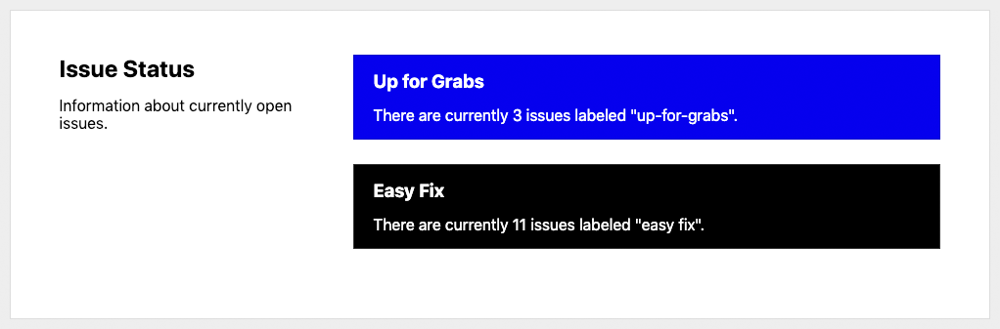
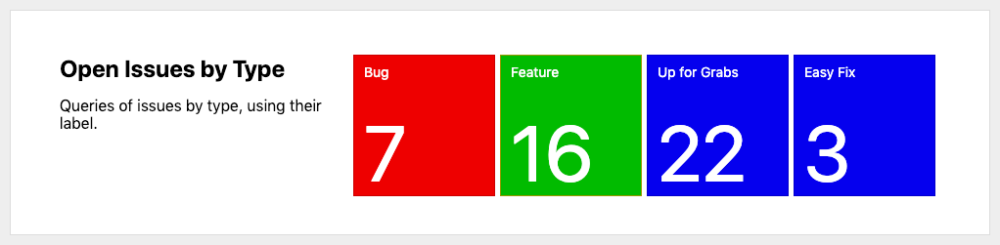
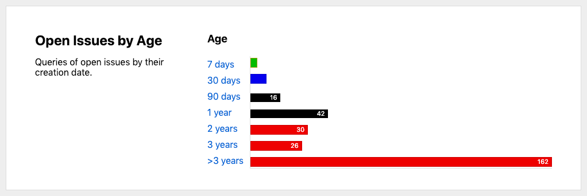
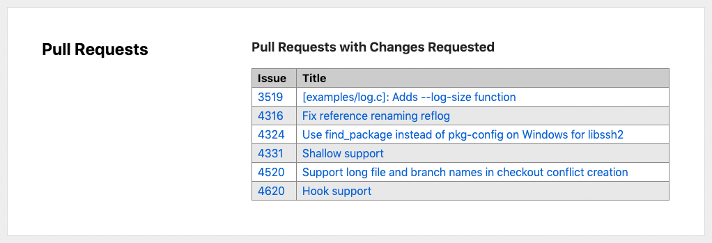



# issue-dashboard

[](https://github.com/ethomson/issue-dashboard/actions?query=workflow%3ACI)

**issue-dashboard** is a framework for creating dashboards from user data on GitHub, utilizing [GitHub Actions](https://github.com/features/actions) and [GitHub Pages](https://pages.github.com/).  You can collect data out of GitHub using issue queries or arbitrary JavaScript that you define, and this tool will generate dashboards in HTML or Markdown.

## Overview

A dashboard contains _widgets_ that contain data about your project:

**String widgets** display a string.



**Number widgets** display numeric values in a compact form.



**Graph widgets** display a bar chart.



**Table widgets** display multiple rows in tabular form.



For more information about widgets, see the [documentation](documentation#overview).

## Installation

This dashboard tool is an _action_ meant to be used in a [GitHub Actions](https://github.com/features/actions) workflow.  You should provide your input in your workflow, and it will produce HTML or Markdown.  You can then either upload the result to GitHub Pages, or update an issue or file in the repository.

For example, a _step_ in a GitHub Actions workflow to run this action:

```yaml
- name: 'Generate Dashboard'
  uses: ethomson/issue-dashboard@v1
  with:
    config: |
      title: 'Dashboard'
      output:
        format: html
        filename: 'dashboard.html'
      sections:
      - title: 'Pull Requests'
        widgets:
        - type: 'table'
          title: 'New Pull Requests (This Week)'
          issue_query: 'repo:libgit2/libgit2 is:open is:issue created:>{{ date("-7 days") }} sort:created-asc'
    token: ${{ github.token }}
```

For more information about installation, see the [documentation](documentation#installation).

## Example Configuration

* **[Static values](https://github.com/ethomson/issue-dashboard/blob/master/examples/static-values.yml)** ([Rendered output](https://ethomson.github.io/issue-dashboard/examples/static-values.html))
  The simplest way to configure a dashboard is using static values.  This may be useful to provide a rendered dashboard to existing data, which can be exported as YAML or JSON configuration.

* **[GitHub issue and pull request queries](https://github.com/ethomson/issue-dashboard/blob/master/examples/issue-queries.yml)** ([Rendered output](https://ethomson.github.io/issue-dashboard/examples/issue-queries.html))
  Dashboards can query GitHub issue and pull request data easily, by providing the query string.  Either the number of matching results will be displayed (for numeric values) or the actual results of the query will be shown (for tables).  Helpful date and time manipulation functions are included.

* **[JavaScript expressions](https://github.com/ethomson/issue-dashboard/blob/master/examples/javascript-expressions.yml)** ([Rendered output](https://ethomson.github.io/issue-dashboard/examples/javascript-expressions.html))
  Dashboards can execute JavaScript expressions to provide the values for widgets.

For more information about configuration, see the [documentation](documentation#configuration).

## Documentation

Documentation is available at [https://ethomson.github.io/issue-dashboard/documentation/](https://ethomson.github.io/issue-dashboard/documentation/).

## Limitations

Currently, this tool only supports instantaneous data -- for example: how many issues with a certain label are open _right now_, or how many pull requests are currently open that were created within the last week.  It does not support time series, meaning you cannot plot a graph of the number of open issues per day.

## License

Available under the MIT license, see the included [`LICENSE.txt`](LICENSE.txt) file for details.


